# L0G1 Linux基础知识
## 1. SSH连接与端口映射

### 1.1 使用密码进行SSH连接

连接前首先需要在vscode中安装配置插件remote-ssh，随后创建开发机。完成开发机的创建后，在开发机界面可以看到ssh连接字样，点击ssh连接可以看到开发机对应的ssh登录命令和密码。

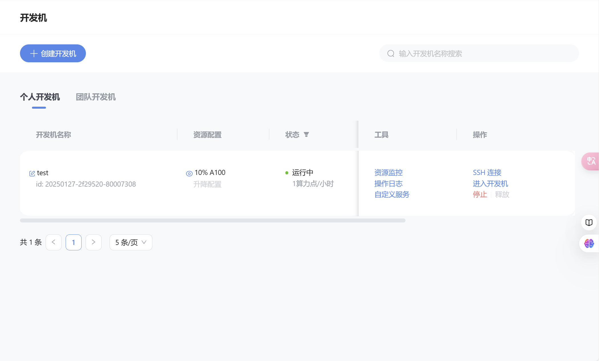

随后来到vscode中，点击左侧边栏的remote-ssh插件，点击+号，添加一条ssh配置。

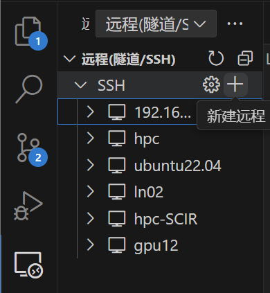

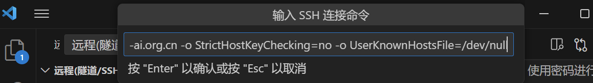

随后我们可以借助vscode查看C盘中对应的配置文件，这里为了区分，我们修改ssh配置项的名称为ShuSheng-01。

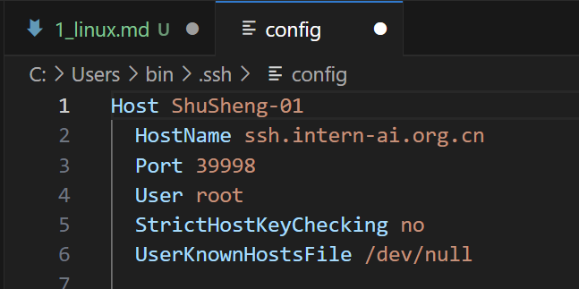

保存之后我们可以看到左侧边栏的内容也发生了改变。随后我们通过remote-ssh进行连接，并根据提示在顶栏输入密码。完成登陆后打开终端，发现已经进入了开发机的os中。

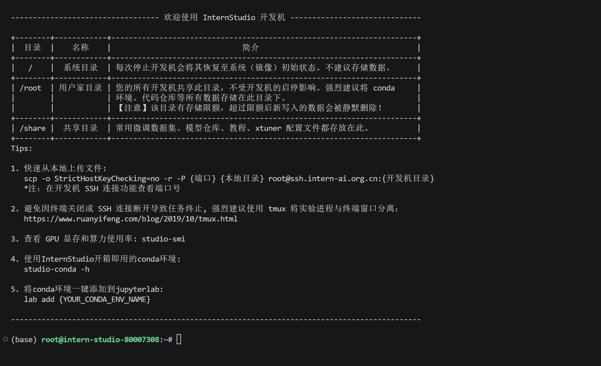

之后我们可以通过linux指令查看开发机名称、内核信息、版本信息和GPU信息等

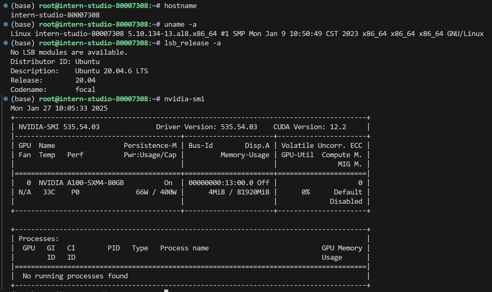

### 1.2 配置SSH密钥进行SSH远程连接

每次远程都输入账号密码属实太过麻烦了一点，所以我们在这里配置一个SSH密钥，这样每次在登录时不需要输入密码。

这个过程首先需要使用RSA算法生成密钥

```bash
ssh-keygen -t rsa       # -t 指定类型 rsa为加密算法
```
通过指令我们可以生成密钥id_rsa，生成路径为/root/.ssh/id_rsa
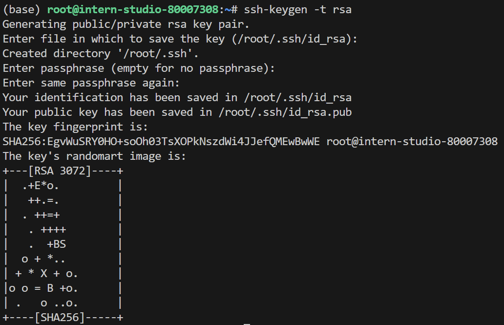

我们切换到对应目录下，发现可以找到两个文件，分别是id_rsa和id_rsa.pub。

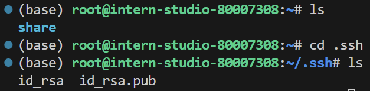

使用cat指令可以查看生成的密钥内容

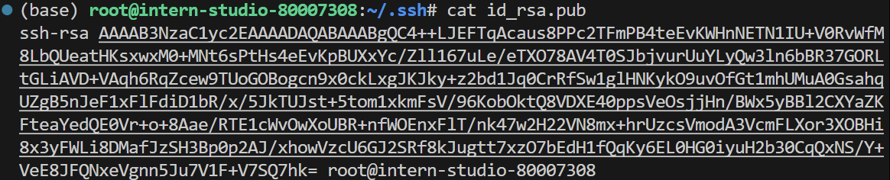

这里是生成的公钥的内容。随后根据指导书中的要求，我们需要将公钥复制粘贴到InternStudio的SSH公钥管理中。

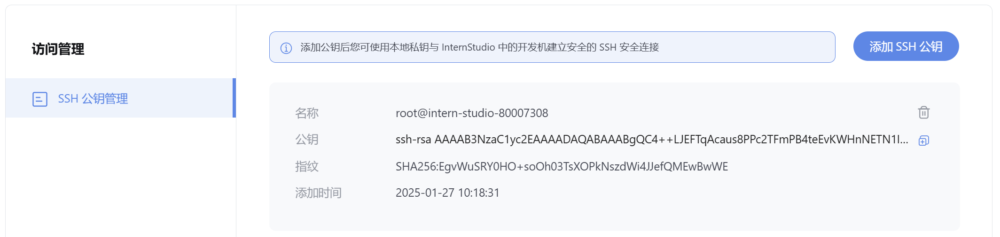

之后，我们还需要将私钥下载到本地并完成在本地的配置。这里需要完成两个步骤，首先需要修改ssh配置文件，增加IdentityFile字段，其值为私钥文件在本地的路径。

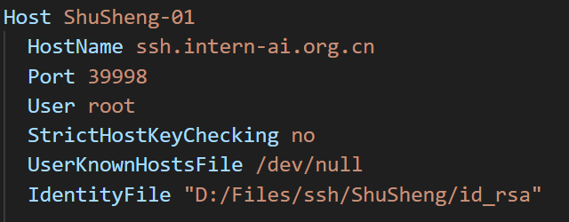

之后我们需要在本地找到id_rsa文件，并且修改安全权限。我们需要确保私钥文件只能由用户控制，而不能是用户组。为了简单操作，我们直接禁用继承之后直接添加当前用户为文件控制者。

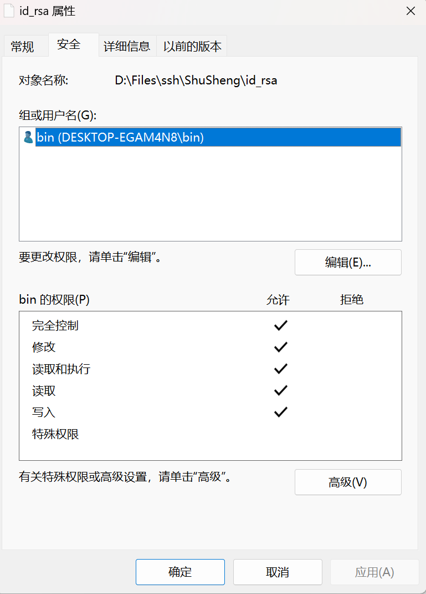

之后我们关闭打开的vscode连接，重新进行ssh连接，发现不需要密码，可以直接完成连接。

### 1.3 端口映射

由于开发机位于云端且不具备公网ip，同时也不具备访问外网资源的能力。为了在我们的后续学习过程中能够部署模型的web demo，我们需要使用端口映射将开发机的端口映射到本地主机端口，使用本地连接访问。

PC在ssh连接开发机的过程中，开发机只会将特定的端口暴露在外，用于作为ssh隧道。而端口映射的原理是让远程开发机监听个人PC的端口，任何发送到本地7860端口的流量，都会被SSH隧道转发到远程服务器的127.0.0.1地址上的7860端口。

这是使用端口映射所需要的ssh命令，这里我们需要将本地机器_PORT和开发机_PORT分别对应进行修改

```bash
ssh -p 39998 root@ssh.intern-ai.org.cn -CNg -L {本地机器_PORT}:127.0.0.1:{开发机_PORT} -o StrictHostKeyChecking=no
```

接下来我们尝试使用端口映射将运行在服务器上的gradio界面映射到本地。首先我们在开发机上运行gradio脚本。先在不进行端口映射的情况下我们运行脚本，发现可以接收到文本信息，这是因为vscode自动帮助我们进行了端口转发。


随后我们关闭vscode的端口转发，在浏览器刷新界面，发现无法访问gradio界面。

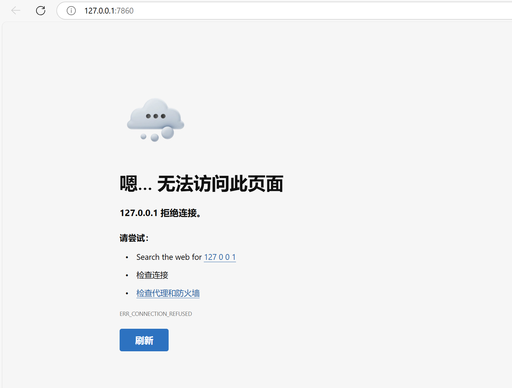

之后我们尝试端口映射，在本地机器powershell中运行下面的命令

```bash
ssh -p 39998 root@ssh.intern-ai.org.cn -CNg -L 7860:127.0.0.1:7860 -o StrictHostKeyChecking=no
```

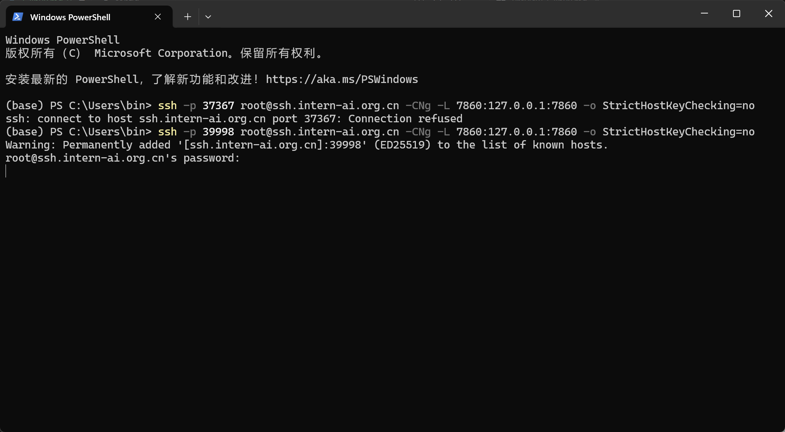

之后我们再次在浏览器刷新界面，发现又可以访问到gradio界面了。

## 2. Linux基本指令

### 2.1 touch

用touch可以创建文件

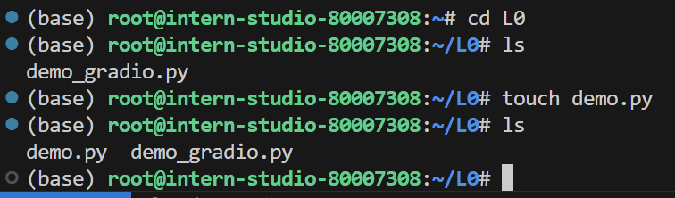

### 2.2 mkdir

创建目录

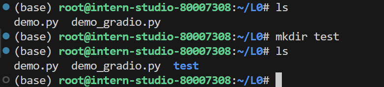

### 2.3 cd

切换目录

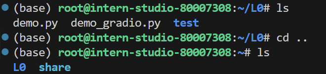

### 2.4 pwd

查看当前所在目录

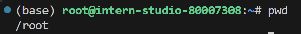

### 2.5 cat

查看文件内容


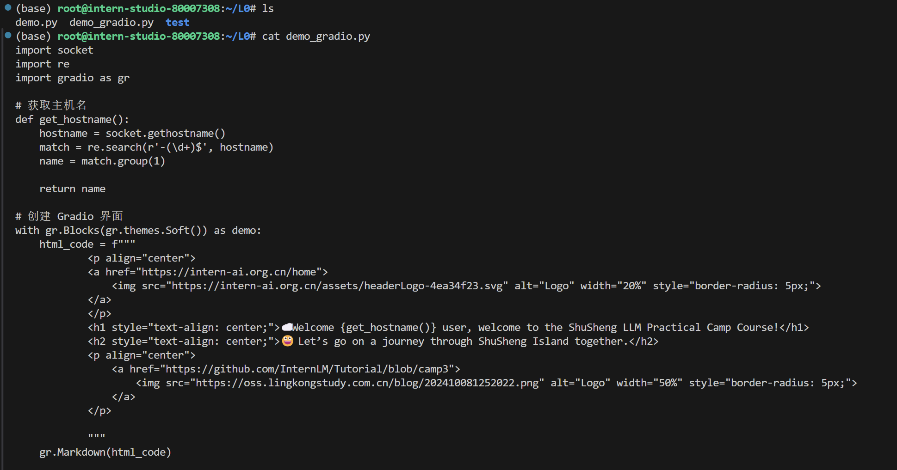

### 2.6 cp和ln

cp命令用于实现复制

- 复制文件 `cp 源文件 目标文件`
- 复制目录 `cp -r 源目录 目标目录`

还有一种软链接的形式，只产生一个特殊的档案，档案的内容指向文件所在位置

```bash
ln [参数][源文件或目录][目标文件或目录]
```


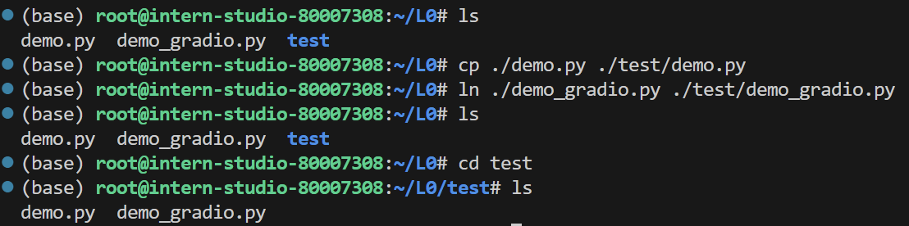

### 2.7 mv和rm

mv指令实现文件移动


```bash
mv file1.txt dir1/      # 将文件file1.txt移动到dir1中
mv file1.txt file2.txt  # 将文件 file1.txt 重命名为 file2.txt
```

rm指令用于删除文件


```bash
rm file.txt     # 删除文件
rm -r dir1/     # 递归删除目录
```

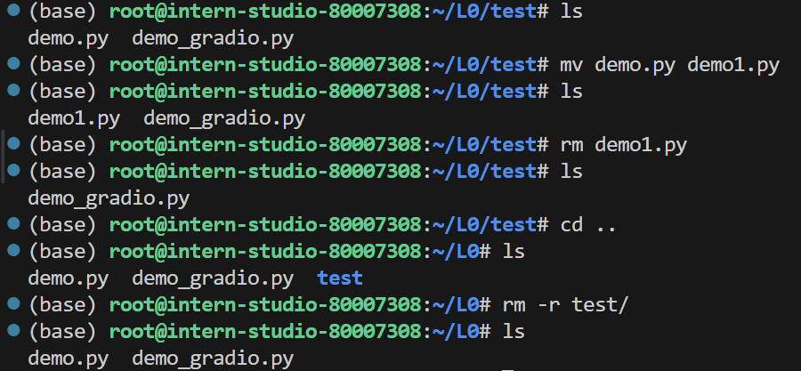

### 2.8 vi和vim

用于实现文件编辑

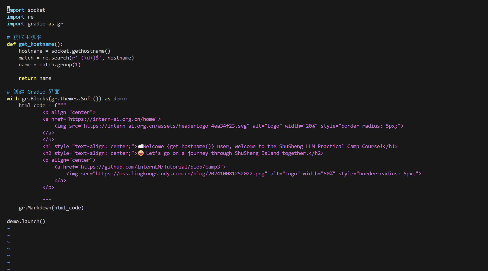

### 2.9 find
用来查找文件

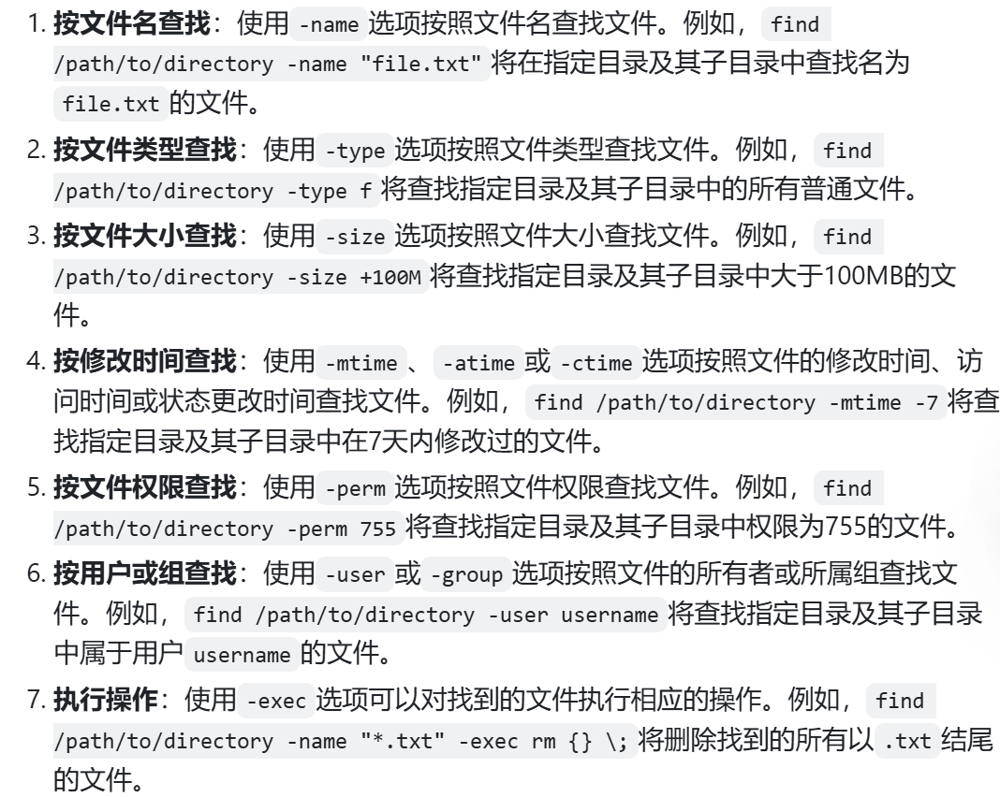

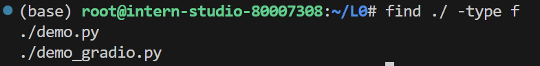

### 2.10 ls

查看目录内容

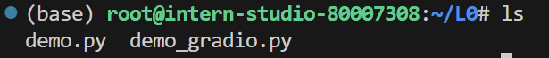

### 2.11 sed

sed用于文本处理

- **参数说明：**
  - `-e<script>` 或 `--expression=<script>`：直接在命令行中指定脚本进行文本处理。
  - `-f<script文件>` 或 `--file=<script文件>`：从指定的脚本文件中读取脚本进行文本处理。
  - `-n` 或 `--quiet` 或 `--silent`：仅打印经过脚本处理后的输出结果，不打印未匹配的行。
- **动作说明：**
  - `a`：在当前行的下一行添加指定的文本字符串。
  - `c`：用指定的文本字符串替换指定范围内的行。
  - `d`：删除指定的行。
  - `i`：在当前行的上一行添加指定的文本字符串。
  - `p`：打印经过选择的行。通常与 `-n` 参数一起使用，只打印匹配的行。
  - `s`：使用正则表达式进行文本替换。例如，`s/old/new/g` 将所有 "InternLM" 替换为 "InternLM yyds"。

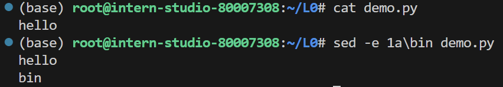

### 2.12 echo
用于打印内容，结合管道符号>可以将内容打印到文件中
```bash
echo "InternLM" > file
```

### 2.12 进程管理

- ps 查看正在运行的进程
  - ps aux
  
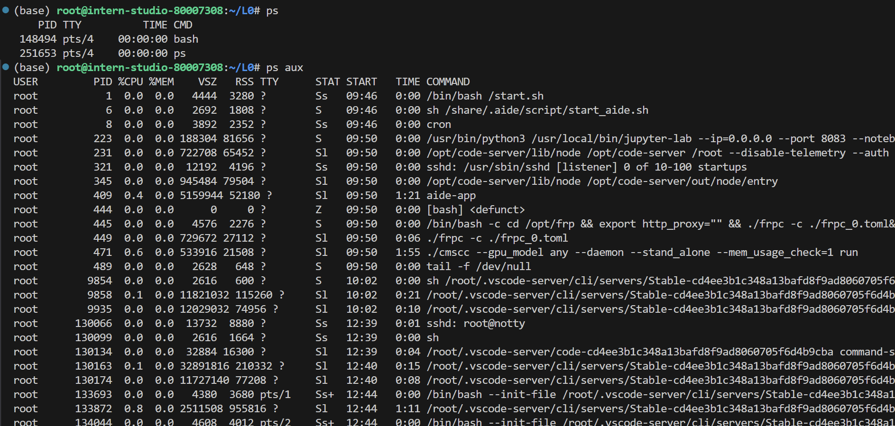

- top 动态显示正在运行的进程

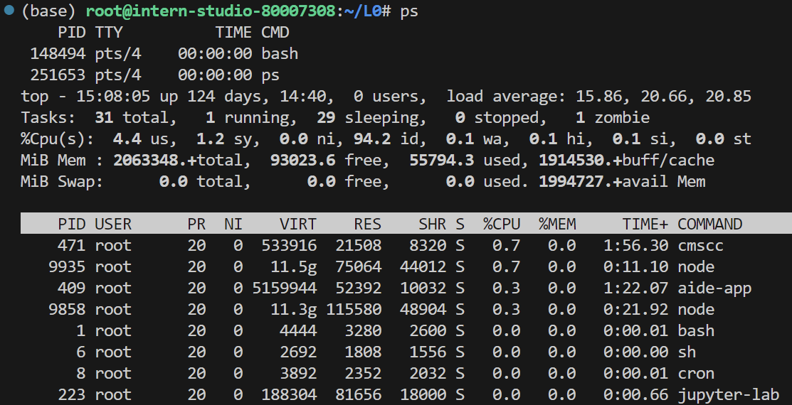

- pstree 树状查看正在运行的进程

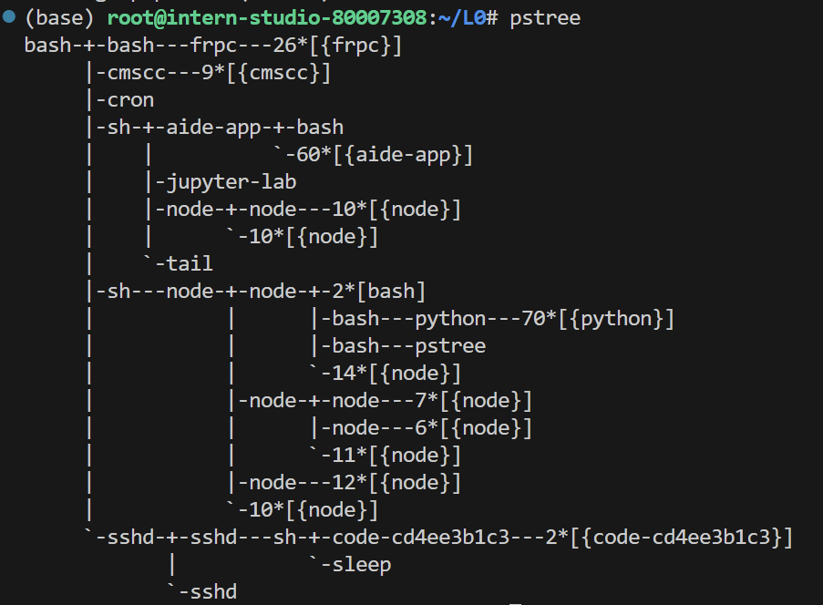

pstree指令无法直接从系统内找到，需要首先安装psmisc

```bash
apt install psmisc
```

- pgrep 查找进程

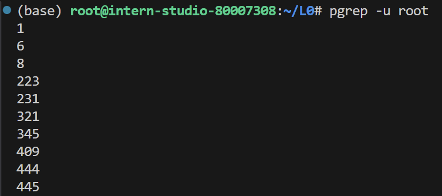

- nice 更改进程优先级
  - `nice -n 10 long-running-command` 
- jobs 显示进程的相关信息
  - `jobs # 列出当前会话的后台作业`
- bg 将挂起的进程放到后台运行，fg 将后台进程调回前台运行。
  - `bg # 将最近一个挂起的作业放到后台运行`
  - `fg # 将后台作业调到前台运行`
- kill 杀死进程
  - `kill PID   # 杀死指定的进程`
  - `kill -9 PID    # 强制杀死进程`

### 2.13 nvidia-smi

- nvidia-smi 显示GPU状态摘要
- nvidia-smi -l 1 显示GPU详细状态信息，每一秒更新依次状态
- nvidia-smi -h 显示gpu的帮助信息
- nvidia-smi pmon   列出GPU并显示它们的PID和进程名称
- nvidia-smi --id-0 --ex_pid=12345 强制结束指定的GPU进程
  - 结束gpu0上PID为12345的进程
- nvidia-smi -i 0 -pm 1 设定GPU0为性能模式
- nvidia-smi --id=0 -r 重启GPU0

## 3. 创建conda环境
首先进行conda换源
```bash
#设置清华镜像
conda config --add channels https://mirrors.tuna.tsinghua.edu.cn/anaconda/pkgs/main
conda config --add channels https://mirrors.tuna.tsinghua.edu.cn/anaconda/pkgs/free
conda config --add channels https://mirrors.tuna.tsinghua.edu.cn/anaconda/pkgs/r
conda config --add channels https://mirrors.tuna.tsinghua.edu.cn/anaconda/pkgs/pro
conda config --add channels https://mirrors.tuna.tsinghua.edu.cn/anaconda/pkgs/msys2
```

随后使用命令创建conda环境
```bash
conda create -n 环境名称 python=指定python版本
```

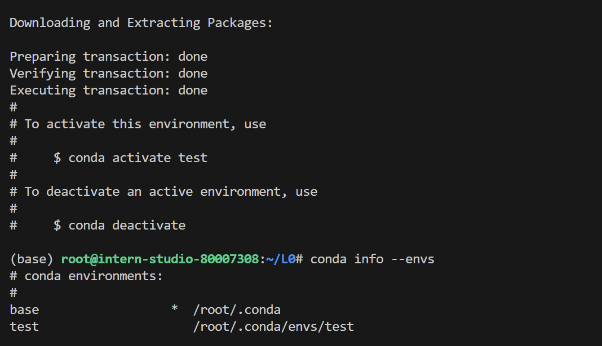